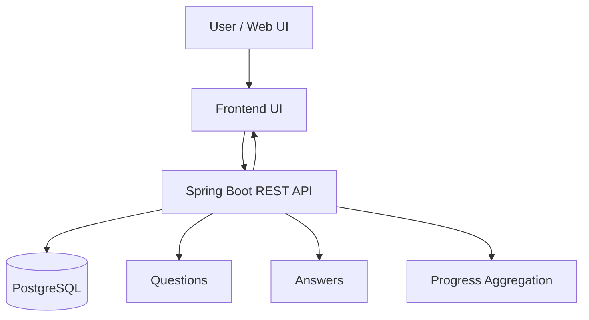

# Interview Trainer Architecture

## Scope
- MVP: a single Spring Boot application (monolith) with clear domain boundaries.
- Later: optional microservice split when Telegram/broker/AI jobs grow.

## High-level modules
1. Question module
   - Select random question(s) by topic.
2. Answer module
   - Persist user answers (selected option + optional free-text).
3. Scoring module
   - MVP rules: score multiple-choice answers (0..10).
   - Later: AI scoring for free-text + feedback.
4. Progress module
   - Aggregate attempts and average score per topic.
5. AI adapter (optional)
   - Wrap LLM calls and normalize output into score/feedback.
6. Telegram adapter (later)
   - Translate Telegram messages into API calls and back.
7. Async jobs + broker (later)
   - Move AI scoring and aggregation updates to background workers.

## Data flow (MVP)

1. `GET /api/v1/questions/next`
   - Reads seeded questions/topics from DB (or initial JSON load).
   - Uses `X-User-Id` to enable adaptive rotation (bias toward weak topics).
2. `POST /api/v1/answers`
   - Persists answer -> calculates score -> updates topic progress -> returns feedback.
3. `GET /api/v1/progress`
   - Reads aggregated statistics for UI.

## Implementation notes
- Keep domain logic inside services (not controllers) so later microservice split is easier.
- Use DTOs for API boundaries to avoid leaking internal entity schemas.
- Define a stable scoring contract early:
  - input: question, user answer
  - output: numeric score + user-facing feedback

